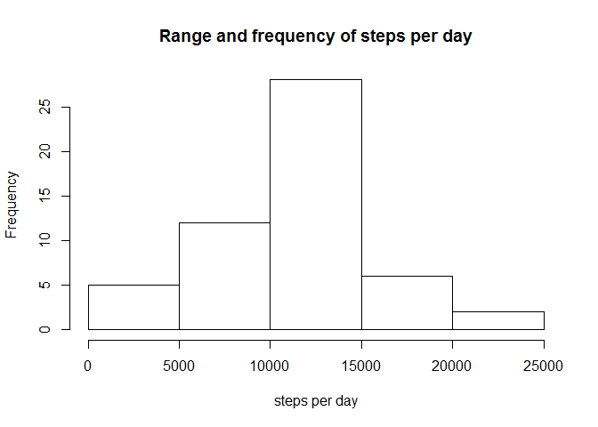

# Reproducible Research: Peer Assessment 1


## Loading and preprocessing the data


```r
library(dplyr)
```

```
## 
## Attaching package: 'dplyr'
```

```
## The following objects are masked from 'package:stats':
## 
##     filter, lag
```

```
## The following objects are masked from 'package:base':
## 
##     intersect, setdiff, setequal, union
```

```r
activity_data <- unzip("activity.zip", files="activity.csv")
activity_data <- read.csv(activity_data)
activity_data$date <- as.Date(activity_data$date, "%Y-%m-%d")
nas <- filter(activity_data, is.na(activity_data$steps))
na_days <- (unique(nas$date))
without_nas <- filter(activity_data, steps!="NA")
```


## What is mean total number of steps taken per day?


```r
by_day <- group_by(without_nas, date) 
steps_by_day <- summarise(by_day, total=sum(steps))
total_steps <- steps_by_day$total
hist(total_steps, xlab="steps per day", main="Range and frequency of steps per day")
```

<!-- -->


```r
mean_steps <- signif(mean(total_steps),digits=6)
```


```r
median_steps <- signif(median(total_steps), digits=6)
```
The mean number of steps per day was **1.07662\times 10^{4}**, with a median of **1.0765\times 10^{4}**.

## What is the average daily activity pattern?


```r
per_interval <- group_by(without_nas, interval)
steps_per_interval <- summarise(per_interval, avg_steps=mean(steps))
with(steps_per_interval, plot(interval, avg_steps, type="l", xlab="time of day from midnight to 24:00", ylab="average number of steps", main="Average steps by time of day"))
```

<!-- -->

```r
ordered <- arrange(steps_per_interval, desc(avg_steps))
most_active_interval <- ordered[1,1]
```

The most active interval of the day, on average is **835**.

## Imputing missing values


```r
na_rows <- length(nas$steps)
```
For periods of time during the two-month data-collection window, the device used to record steps was inactive, resulting in periods of missing data. There were a total of **2304** 5-minute measurement intervals in which data was not collected. 

If necessary, we can fill each of these unmonitored intervals with the average value for that same interal for the rest of the two-month monitoring period.


```r
activity_no_nas <- activity_data
nas2 <- filter(activity_no_nas, is.na(activity_no_nas$steps))
interval_vector <- steps_per_interval$interval
steps_vector <- steps_per_interval$avg_steps
  
 for(i in seq_along(activity_no_nas$steps)){
   if(is.na(activity_no_nas$steps[i])){
      x <-activity_no_nas[i,"interval"]
      y <- match(x, interval_vector)
      z <- steps_vector[y]
      activity_no_nas[i, "steps"]<-z}
 }
```
Now that the missing values have been compensated for, the total number of steps taken per day now looks as follows:


```r
by_day_no_nas <- group_by(activity_no_nas, date) 
daily_steps_no_nas <- summarise(by_day_no_nas, total=sum(steps))
total_steps_no_nas <- daily_steps_no_nas$total
hist(total_steps_no_nas, xlab="steps per day", main="Steps per day with missing data accounted for")
```

<!-- -->


```r
mean_steps_no_nas <- mean(total_steps_no_nas)
```


```r
median_steps_no_nas <- median(total_steps_no_nas)
```
If we also consider the mean and median of this adjusted data -- **mean = 1.0766189\times 10^{4}** and **median = 1.0766189\times 10^{4}** -- we see that adjusting for the missing data results in a small but notable change.


## Are there differences in activity patterns between weekdays and weekends?

The collected data shows a notable difference in step counts between weekdays and weekends, with lower overall activity on the weekends as well as a shift in peak activity from mornings on weekdays to afternoons on weekends.


```r
activity_no_nas <- mutate(activity_no_nas, weekdys = weekdays(date))
activity_no_nas[, "weekdys"] <- ifelse(activity_no_nas[, "weekdys"]=="Saturday" | activity_no_nas[, "weekdys"]=="Sunday", "weekend","weekday")

library(ggplot2)
qplot(interval, steps, data=activity_no_nas, facets=weekdys~., geom='line',
      main="Comparing weekend to weekday step numbers", ylab="number of steps")
```

<!-- -->

